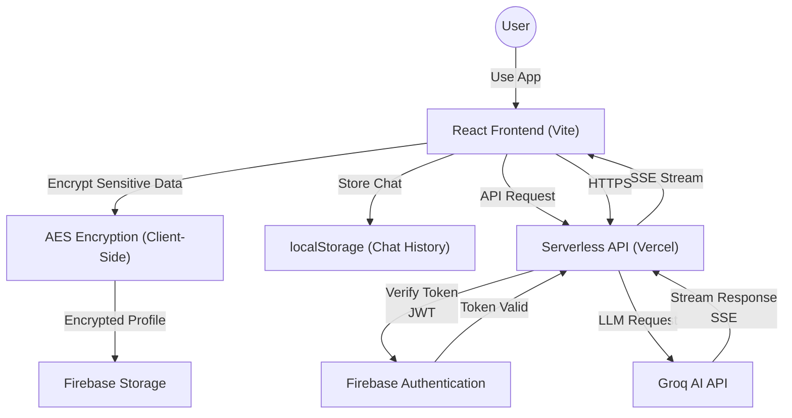
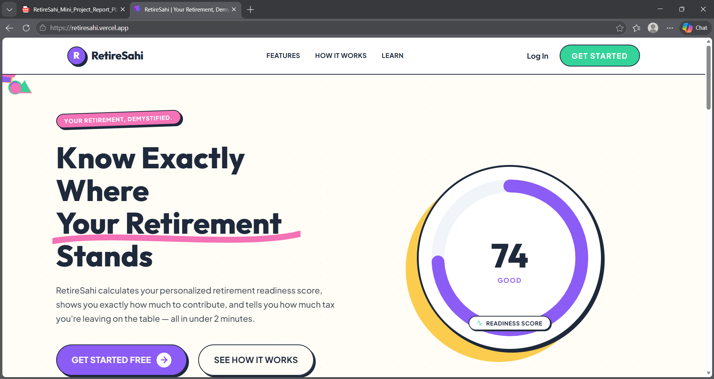
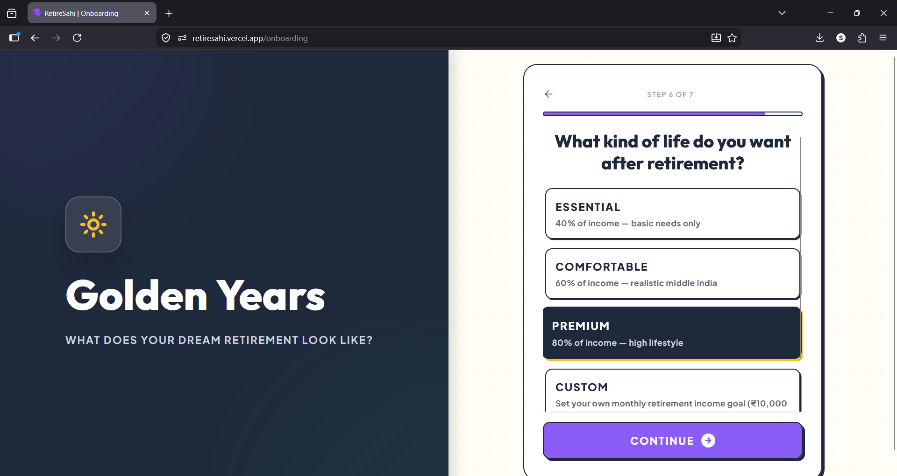
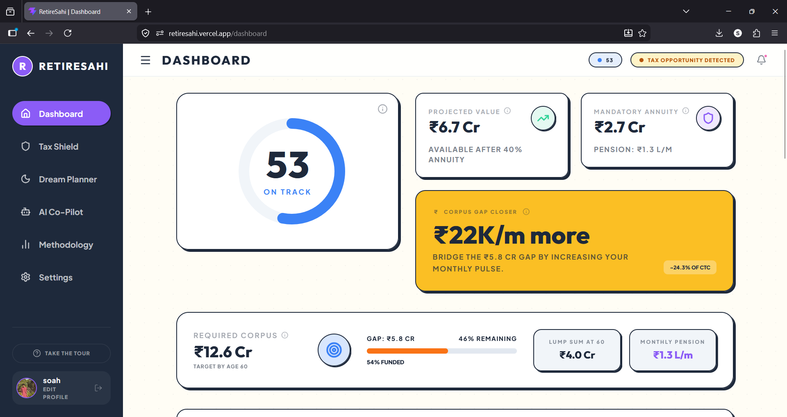
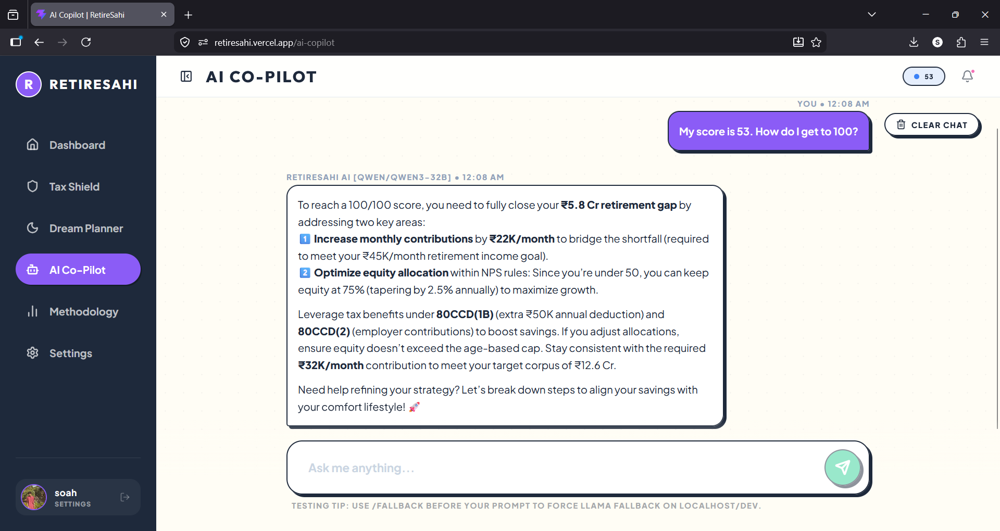
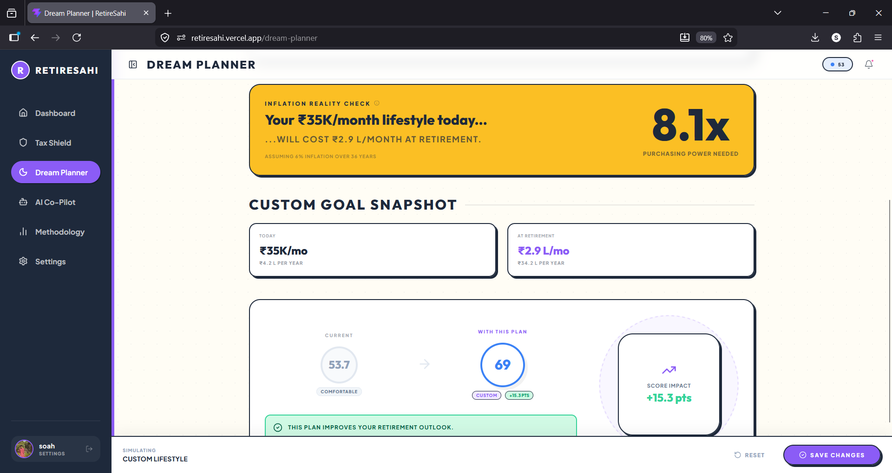
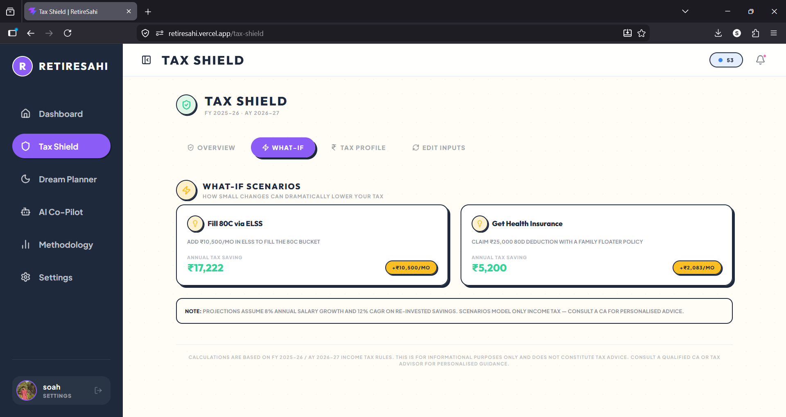

# RetireSahi — Your Retirement, Demystified.

This README documents the Website/ folder of the RetireSahi full-stack project.

---

## Table of Contents
- Project Overview
- Features
- Tech Stack
- System Architecture
- Installation & Setup
- Environment Variables
- API Overview
- Security Considerations
- Demo
- Screenshots
- Future Improvements
- Where to find sensitive logic
- License

---

## Project Overview
- Problem: Many individual investors and NPS subscribers lack clear, personalized retirement planning tools and actionable financial literacy guidance.
- Purpose: Provide a privacy-first, AI-assisted retirement co-pilot that converts encrypted user profile data into clear retirement projections, contribution guidance, and tax-aware suggestions.
- Target users: Indian NPS subscribers and retail users seeking simple, actionable retirement planning advice.

## Features
- Personalized retirement planning and score-based recommendations
- AI-powered assistant using the Groq API with primary + fallback model support
- Real-time streaming responses (SSE) for progressive UI rendering
- Privacy mode vs Full mode for selective sharing of profile fields
- Financial projections: corpus estimation, monthly gap analysis, required contribution calculations
- Tax planning assistance and NPS-specific rule guidance
- Authentication via Firebase Authentication
- Client-side AES-GCM encryption for sensitive fields before saving to Firestore
- Rate-limited backend to reduce abuse

## Tech Stack
- Frontend: React (JSX), JavaScript, Vite, CSS (Tailwind used in codebase)
- Backend: Node.js serverless functions (Vercel)
- AI: Groq API (LLM) with fallback model support
- Auth: Firebase Authentication (client) + Firebase Admin (server)
- Storage: `localStorage` (chat history) and Firestore (user profiles)
- Security: AES-GCM client-side encryption, HTTPS transport
- Deployment: Vercel

## System Architecture

### High-Level Flow
1. User → React frontend (browser)
2. Frontend → `POST /api/groq` (Vercel Serverless)
3. Serverless function validates Firebase ID token, enforces rate limits, then forwards messages to Groq (primary model first, optional fallback)
4. Groq → Serverless → Frontend (SSE streaming)
5. Frontend progressively renders assistant tokens and persists chat locally; profile updates and encrypted fields saved to Firestore

### Detailed Architecture Diagram



### Key Components Explained

**Client Layer (Browser)**
- React app with component-based UI
- AES-GCM encryption utilities for sensitive fields
- Firebase Client SDK for auth + Firestore operations
- localStorage for persistent chat history per user
- Vite as build tool with environment variable support

**Serverless Layer (Vercel)**
- Single endpoint: `POST /api/groq`
- Validates Firebase ID tokens using Firebase Admin SDK
- Per-user rate limiting (in-memory; upgrade to Redis for production)
- Model fallback logic: tries primary first, falls back on error or `forceFallback` flag
- SSE streaming to enable progressive token rendering

**External Services**
- Groq API: primary + fallback LLM models
- Firebase: authentication + Firestore for encrypted profile storage

**Data Flow Notes**
- Streaming: SSE allows frontend to render tokens as they arrive (not wait for full response)
- Encryption: sensitive fields encrypted client-side before Firestore writes
- Authentication: Firebase ID tokens ensure only authenticated users can call the serverless function
- Rate limiting: prevents abuse by limiting requests per user per minute

## Installation & Setup (Website folder)
1. Clone repository and change to the Website folder:

```bash
git clone <repo-url>
cd <repo>/Website
```

2. Install dependencies:

```bash
npm install
```

3. Run locally (development):

```bash
npm run dev
```

4. Build for production:

```bash
npm run build
# optional preview
npm run preview
```

5. The `Website/` folder contains the React app, client-side encryption utilities, and the serverless function `api/groq.js`.

## Environment Variables
Server-side (Vercel) — required for production serverless functions:
- `GROQ_API_KEY` — Groq API key (server only)
- `GROQ_PRIMARY_MODEL` — optional primary model id
- `GROQ_FALLBACK_MODEL` — optional fallback model id
- `FIREBASE_PROJECT_ID` — Firebase project id
- `FIREBASE_CLIENT_EMAIL` — Firebase service account client email
- `FIREBASE_PRIVATE_KEY` — Firebase service account private key (PEM string). When adding in Vercel, ensure newline characters are preserved.

Client-side (Vite, prefixed with `VITE_`) — used only by frontend:
- `VITE_GROQ_API_KEY` — optional (used for direct Groq dev on localhost)
- `VITE_GROQ_PRIMARY_MODEL` — client model default
- `VITE_GROQ_FALLBACK_MODEL` — client fallback model
- `VITE_FIREBASE_API_KEY`, `VITE_FIREBASE_AUTH_DOMAIN`, `VITE_FIREBASE_PROJECT_ID`, `VITE_FIREBASE_MESSAGING_SENDER_ID`, `VITE_FIREBASE_APP_ID` — Firebase web config

Important: Never commit server-side secrets to source control. Add them in Vercel or another secret manager.

## API Overview
Endpoint
- `POST /api/groq` — serverless proxy for Groq chat completions

Request format (example):

```json
{
  "messages": [
    { "role": "system", "content": "..." },
    { "role": "user", "content": "..." }
  ],
  "stream": true,
  "forceFallback": false
}
```

Headers
- `Authorization: Bearer <Firebase ID Token>`
- `Content-Type: application/json`

Response format
- Streaming via SSE (`text/event-stream`) with incremental JSON chunks:
  - `data: { ... }` — token/chunk payloads (may include `type: "meta"` with model metadata)
  - `data: [DONE]` — stream end sentinel

Behavior
- Server verifies the Firebase token, checks rate limits, attempts Groq request, and streams responses back to the client.
- On rate-limit or errors, API returns appropriate HTTP status (e.g., 429) and error JSON.

## Security Considerations
- API keys and service account credentials live server-side (Vercel environment variables) and are never bundled with client code.
- All calls to `POST /api/groq` require a valid Firebase ID token; tokens are verified using Firebase Admin on the server.
- Sensitive profile fields are encrypted client-side using AES-GCM before being written to Firestore.
- Transport should be HTTPS in production; do not expose private keys in client bundles.

## Demo

<iframe src="https://drive.google.com/file/d/1CXtT4w6IaGU6sODMNFpYUziP1E_BbKhn/preview" width="100%" height="480" allow="autoplay"></iframe>

## Screenshots

### Landing Page


### Onboarding Flow


### Dashboard - Financial Overview


### AI Co-Pilot - Real-time Streaming Chat


### Dream Planner - Goal Setting


### Tax Shield - Tax Planning Module


## Future Improvements
- Move rate limiting to Redis (distributed token/bucket) for production reliability
- Improve client state management (migrate to Redux/Zustand or use React Query for data fetching)
- Add retrieval-augmented generation (RAG) for personalized answers and secure vector store
- More robust observability: structured logs, Sentry integration
- Expand accessibility and internationalization (i18n)

## Where sensitive logic lives (quick reference)
- Frontend encryption: `src/utils/encryption.js`
- Client AI flow & streaming: `src/pages/AICopilot.jsx`
- Serverless proxy & auth: `api/groq.js`
- Firebase initialization: `src/lib/firebase.js`
- Chat persistence: `localStorage` keys `retiresahi_chat_history_<uid>`

## License
This project is licensed under the MIT License. See the `LICENSE` file at the repository root for details.